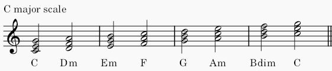
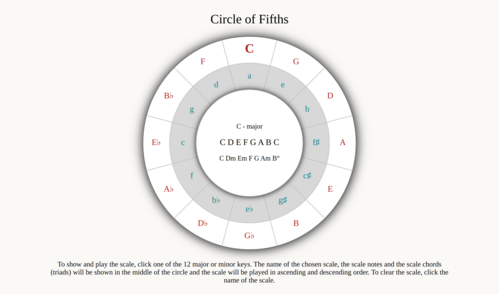

# 1. Circle of Fifths

In music theory, the circle of fifths is a way of organizing pitches as a sequence of perfect fifths. Starting on a C, and using the standard system of tuning for Western music (12-tone equal temperament), the sequence is: C, G, D, A, E, B, F♯ (G♭), C♯ (D♭), G♯ (A♭), D♯ (E♭), A♯ (B♭), E♯ (F), C. This order places the most closely related key signatures adjacent to one another. (source: https://en.wikipedia.org/wiki/Circle_of_fifths) It is usually illustrated in the form of a circle.

# 2. Requirements

In this project tone.js is used to play the chosen scale. There are no further requirements or packages needed.

# 3. Table of Contents

- [1. Circle of Fifths](#1-circle-of-fifths)
- [2. Requirements](#2-requirements)
- [3. Table of Contents](#3-table-of-contents)
- [4. Structure](#4-structure)
  - [4.1 index.html](#41-indexhtml)
  - [4.2 scripts folder](#42-scripts-folder)
    - [4.2.1 scale-keys.js](#421-scale-keysjs)
    - [4.2.2 scale-object.js](#422-scale-objectjs)
    - [4.2.3 render-svg.js](#423-render-svgjs)
    - [4.2.4 circle-of-fifths.js](#424-circle-of-fifthsjs)
  - [4.3 styles folder](#43-styles-folder)
  - [4.4 sounds folder](#44-sounds-folder)
- [5. License](#5-license)

# 4. Structure

## 4.1 index.html

The index.html file only holds one div element. In this element the circle-of-fifths is created by the script **render-svg.js**. Functionality, such as showing the scale name, the scale, the scale chords and playing the scale, is created by the script **circle-of-fifths.js** after the circle of fifths is rendered.

## 4.2 scripts folder

The scripts folder holds the following files:

- scale-keys.js
- scale-object.js
- render-svg.js
- circle-of-fifths.js

### 4.2.1 scale-keys.js

This file contains an array named scale-keys which holds the twelve major and minor keys as objects. The structure of the object is simple, see below example.

```
const scaleKeys = [
  {
    major: { key: "C", show: "C" },
    minor: { key: "A", show: "a" },
  },

  ...
]
```

The example shows the major and relative minor of C. The array is used by **render-svg.js** to place the major and minor keys in the major respectively minor circles.

### 4.2.2 scale-object.js

This file holds four array variables:

- majorScale, holding the twelve major keys
- minorScale, holding the twelve natural minor keys
- majorScaleObject, holding twelve objects for the major keys
- minorScaleObject, holding twelve objects for the minor keys

Below an example of the majorScale object

```
const majorScaleObject = [
  {
    key: "C",
    scale: "C D E F G A B C",
    chords: "C Dm Em F G Am Bdim",
    sound: "C-major.mp3",
    triads; "C-major-triads.mp3",
  },
  ...
]
```

The example shows the C major key signature, the actual notes of the scale, the chords belonging to the scale, the sound used by tone.js and the scale chords (triads) also used by tone.js. See below image of scale chords.



Explantion. The third note (scale degree) of the D-major scale is F♯. As the C-major scale does not have any sharps or flats, F♯ becomes F which is a minor third making the chord Dm. Another way to look at it is as follows. The D-minor scale is the relative minor of F-major: F G A B♭ C D E F. The D in this scale is the 6st note or scale degree. Starting from D the D-minor scale is: D E F G A B♭ C D. The F is a minor third making the chord (D F A) a D minor. The same logic applies to the Em and Am scale chords of the C-major scale. The odd one out is Bdim. This chord has a minor third and diminished fifth, making the chord diminished.

### 4.2.3 render-svg.js

This script starts by creating the svg element which is appended to the div element. It then adds the defs element, to which two filter elements are appended. Within both filter elements the feDropShadow element is appended.

After the defs element, two circle elements are appended to the svg element. The script further appends twelve line elements using trigonometry to place them within the two circles in steps of 30 degrees, using an offset of 15 degrees. This divides the circles in twelve equal segments.

Thereafter the script appends a third circle element to cover the lines after the second circle. The scripts then appends twenty four text elements using trigonometry to place the keys within the first two circles. Each text elements shows the major and minor keys which are held in the scale-keys array.

To hold the text for the scale name, the scale and scale chords, the scripts appends three text elements to the svg element. Finally, the script appends a p element to the div element to show the explanation how to used the circle of fifths.

### 4.2.4 circle-of-fifths.js

The script adds a click event listener to each of the keys by looping through the node list created by the document.querySelectorAll method collecting all elements with the class "key". When a major or minor key is clicked, the processKey function is called. This function looks for the data-key attribute value of the element and the class "major" or "minor".

With those two values as paraments the showScale function is called. This function looks for the index of the key chosen in the majorScale or minorScale array. The index retrieved is then used to retrieve the object contained in the majorScaleObject or minorScaleObject. From the retrieved object the value of the keys "sound", "scale", "chords" and "triads" is retrieved. The retrieved "sound" value and "triads" values are stored in the global variables soundScale and soundChords. These are used by the function playScale and playChords.

The scale name, the scale and the scale chords are shown in the inner circle and the scale is played in ascending and descending order by the playScale function. The chords are played by the playChords function.

The end result looks like this.



The third scale degree of the D-major scale is F♯. This is lowered by one semi-tone making it F making is a Dm. The third scale degree of E-major is G♯, which is lowered to G. Third scale degree of A-major is C♯, which is lowered to C. Third and fifth scale degree of B-major is D♯ respectively F♯ are both lowered with one semi-tone making them D respectively F. This makes it a diminished B chord.

## 4.3 styles folder

This folder contains the file **circle-of-fifths.css**, which holds basic css styles.

## 4.4 sounds folder

This folder containes the mp3 files which were generated by MuseScore Studio. MuseScore Studio is built by an open-source community and is free to use. (see: https://musescore.org/en)

# 5. License

Copyright 2024 Ebel Magnin

Licensed under the Apache License, Version 2.0 (the "License");
you may not use this file except in compliance with the License.
You may obtain a copy of the License at

    http://www.apache.org/licenses/LICENSE-2.0

Unless required by applicable law or agreed to in writing, software
distributed under the License is distributed on an "AS IS" BASIS,
WITHOUT WARRANTIES OR CONDITIONS OF ANY KIND, either express or implied.
See the License for the specific language governing permissions and
limitations under the License.
